作业6实验报告

## 实验要求

Basic: 
1. 实现Phong光照模型： 场景中绘制一个cube 自己写shader实现两种shading: Phong Shading 和 Gouraud Shading，并解释两种shading的实现原理，合理设置视点、光照位置、光照颜色等参数，使光照效果明显显示。
2. 使用GUI，使参数可调节，效果实时更改： GUI里可以切换两种shading 使用如进度条这样的控件，使ambient因子、diffuse因子、specular因子、反光度等参数可调节，光照效果实时更改 

Bonus: 
当前光源为静止状态，尝试使光源在场景中来回移动，光照效果实时更改。 

## 实验截图

1. phong光照模型

   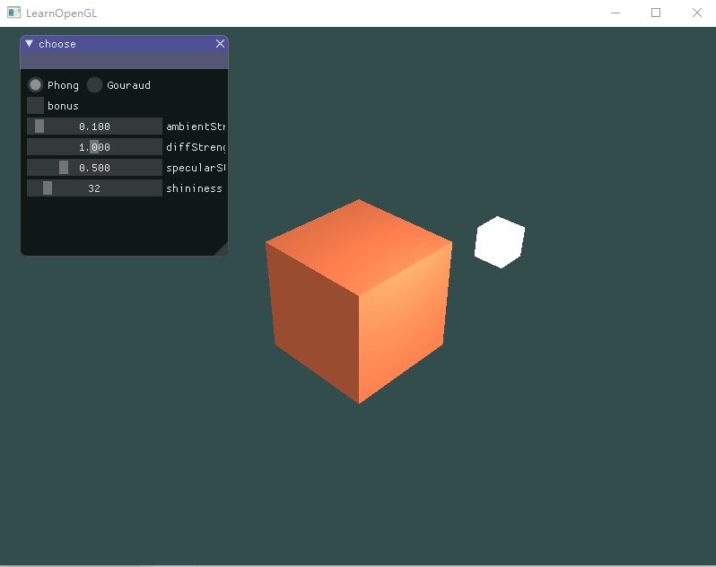

2. gouraud光照模型

3. 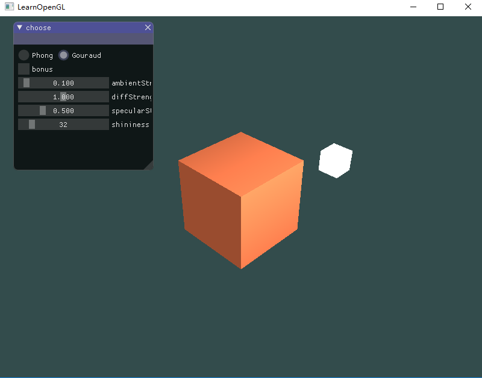

4. GUI调整ambient因子

   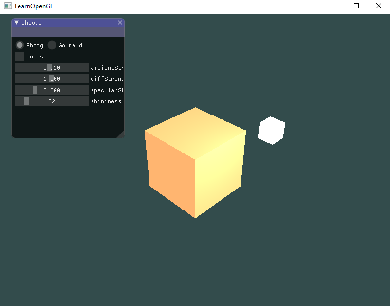

   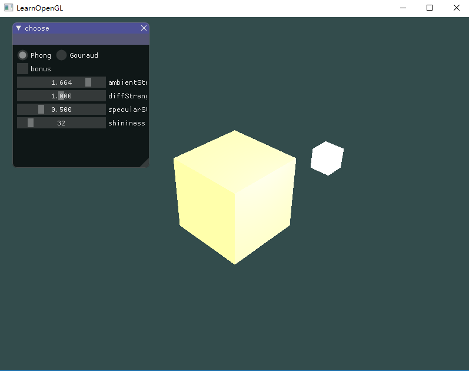

5. GUI调整diffuse因子

   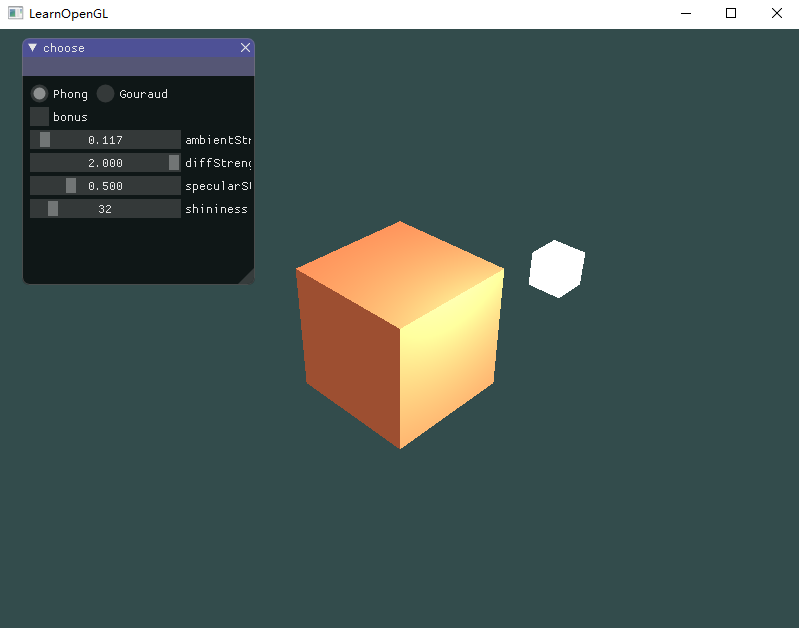

   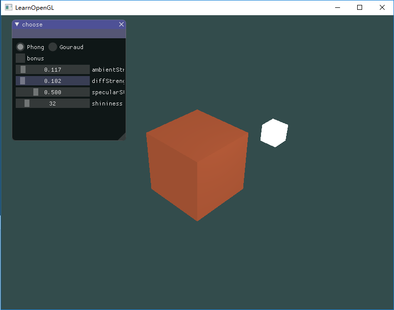

6. GUI调整specular因子

   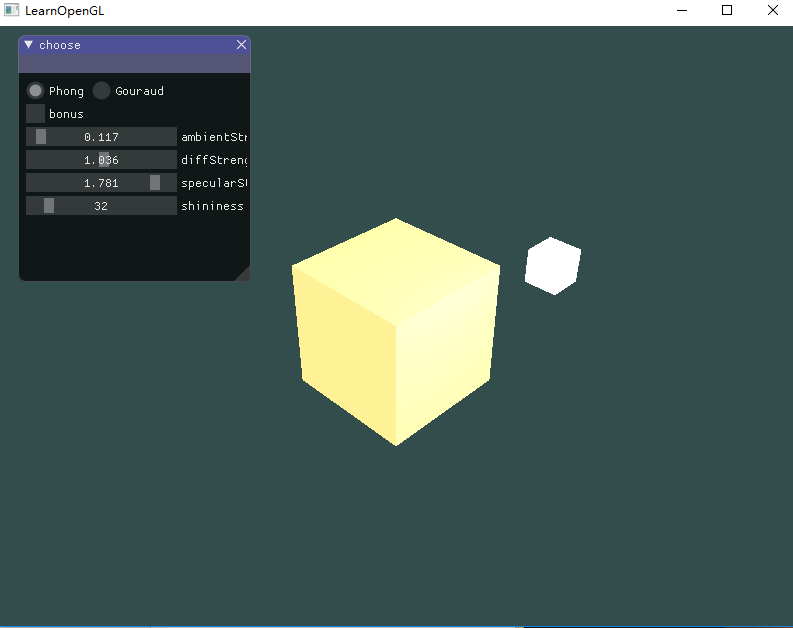

   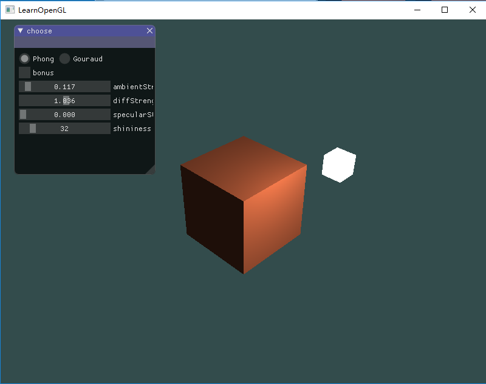

7. GUI调整反光度

   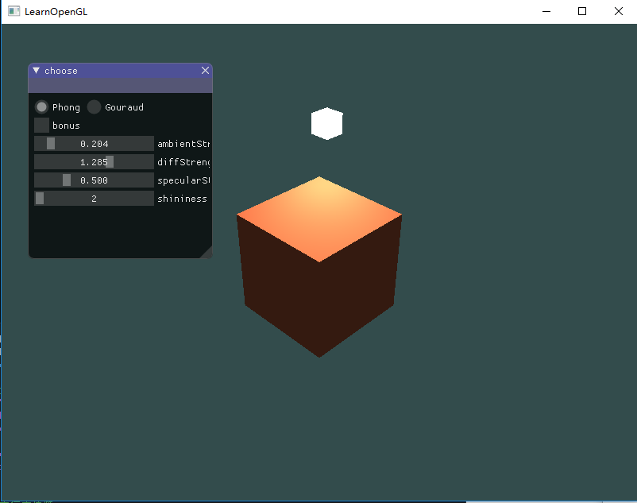

   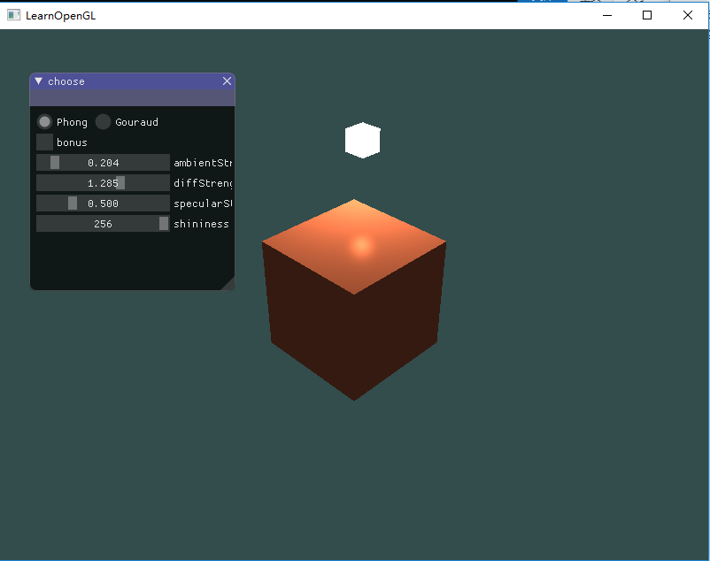

8. bonus

   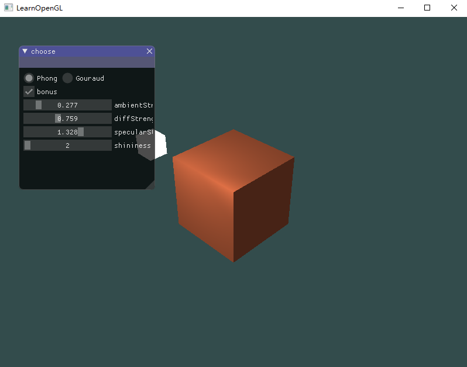

   

   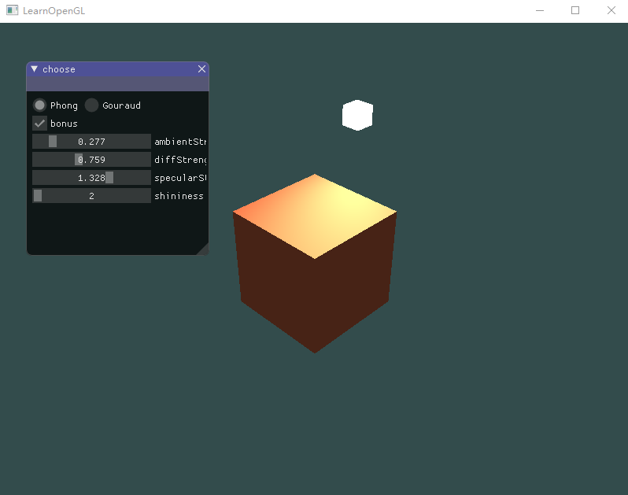

## 关键代码

1. 设置phong、gouraud模型并提供选择

   ```c++
   Shader phongShader("base_light.vs", "base_light.fs");
   Shader gouraudShader("gouraud_light.vs", "gouraud_light.fs");
   
   if (phong) {
       phongShader.use();
       // 设置uniform变量
       phongShader.setVec3("objectColor", 1.0f, 0.5f, 0.31f);
       phongShader.setVec3("lightColor", 1.0f, 1.0f, 1.0f);
       phongShader.setVec3("lightPos", glm::vec3(light_x, light_y, light_z));
       phongShader.setVec3("viewPos", glm::vec3(3, 3, 3));
       phongShader.setFloat("ambientStrength", ambientStrength);
       phongShader.setFloat("diffStrength", diffStrength);
       phongShader.setFloat("specularStrength", specularStrength);
       phongShader.setInt("shininess", shininess);
   }
   else {
       gouraudShader.use();
       // 设置uniform变量
       gouraudShader.setVec3("objectColor", 1.0f, 0.5f, 0.31f);
       gouraudShader.setVec3("lightColor", 1.0f, 1.0f, 1.0f);
       gouraudShader.setVec3("lightPos", glm::vec3(light_x, light_y, light_z));
       gouraudShader.setVec3("viewPos", glm::vec3(3, 3, 3));
       gouraudShader.setFloat("ambientStrength", ambientStrength);
       gouraudShader.setFloat("diffStrength", diffStrength);
       gouraudShader.setFloat("specularStrength", specularStrength);
       gouraudShader.setInt("shininess", shininess);
   }
   ```

2. 提供各因子的调节：

   ```c++
   // 初始化变量
   float ambientStrength = 0.1f, diffStrength = 1.0f, specularStrength = 0.5f;
   int shininess = 32;
   bool bonus = false;
   static int phong = 1;
   ...
   ImGui::RadioButton("Phong", &phong, 1); ImGui::SameLine();
   ImGui::RadioButton("Gouraud", &phong, 0);
   ImGui::Checkbox("bonus", &bonus);
   ImGui::SliderFloat("ambientStrength", &ambientStrength, 0.0f, 2.0f);
   ImGui::SliderFloat("diffStrength", &diffStrength, 0.0f, 2.0f);
   ImGui::SliderFloat("specularStrength", &specularStrength, 0.0f, 2.0f);
   ImGui::SliderInt("shininess", &shininess, 2, 256);
   
   // 传入shader中
   phongShader.setFloat("ambientStrength", ambientStrength);
   phongShader.setFloat("diffStrength", diffStrength);
   phongShader.setFloat("specularStrength", specularStrength);
   phongShader.setInt("shininess", shininess);
   
   // 在shader中的设置
   uniform float ambientStrength;
   uniform float diffStrength;
   uniform float specularStrength;
   uniform int shininess;
   
   void main()
   {
       // ambient
       vec3 ambient = ambientStrength * lightColor;
     	
       // diffuse 
       vec3 norm = normalize(Normal);
       vec3 lightDir = normalize(lightPos - FragPos);
       float diff = max(dot(norm, lightDir), 0.0);
       vec3 diffuse = diffStrength * diff * lightColor;
       
       // specular
       vec3 viewDir = normalize(viewPos - FragPos);
       vec3 reflectDir = reflect(-lightDir, norm);  
       float spec = pow(max(dot(viewDir, reflectDir), 0.0), shininess);
       vec3 specular = specularStrength * spec * lightColor;  
           
       vec3 result = (ambient + diffuse + specular) * objectColor;
       FragColor = vec4(result, 1.0);
   } 
   ```

3. bonus设置光源旋转

   ```c++
   // 初始化光源位置
   float light_x = 1.2f, light_y = 1.0f, light_z = 0.0f;
   
   // 设置旋转
   if (bonus) {
       light_x = sin((float)glfwGetTime()) * 1.2f;
       light_z = cos((float)glfwGetTime()) * 1.0f;
   }
   else {
       light_x = 1.2f;
       light_z = 0.0f;
   }
   
   //设置光源
   lightShader.use();
   lightShader.setMat4("projection", projection);
   lightShader.setMat4("view", view);
   
   model = glm::mat4(1.0f);
   model = glm::translate(model, glm::vec3(light_x, light_y, light_z));
   model = glm::scale(model, glm::vec3(0.2f)); 
   lightShader.setMat4("model", model);
   ```

## 实验思考

两种shading的实现原理

phong shading主要结构由3个元素组成：环境、漫反射和镜面光照。

- 环境光照：即使在黑暗的情况下，世界上也仍然有一些光亮(月亮、一个来自远处的光)，所以物体永远不会是完全黑暗的。我们使用环境光照来模拟这种情况，也就是无论如何永远都给物体一些颜色。
- 漫反射光照：模拟一个发光物对物体的方向性影响。它是冯氏光照模型最显著的组成部分。面向光源的一面比其他面会更亮。
- 镜面光照：模拟有光泽物体上面出现的亮点。镜面光照的颜色，相比于物体的颜色更倾向于光的颜色。

先在顶点着色器中计算得到顶点的法向量，再传给片段着色器中进行颜色的计算。

Gouraud Shading则是再顶点着色器中进行颜色的计算，之后再直接传给片段着色器。其开销会较低，但其光照效果则没有phong shading真实。

