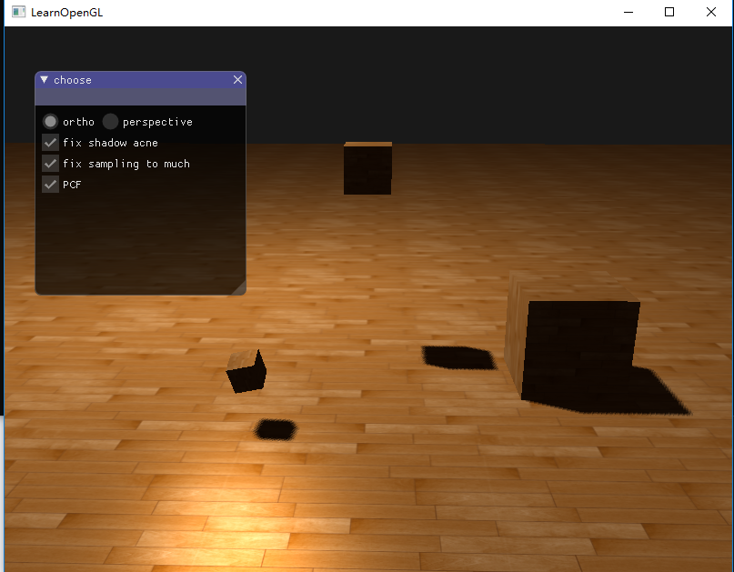
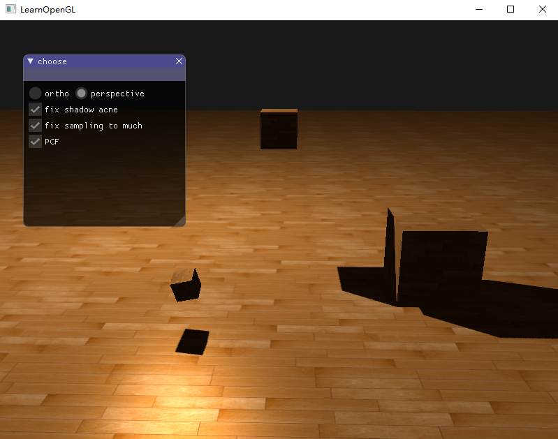
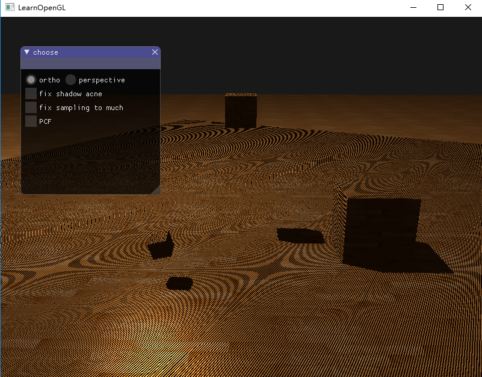
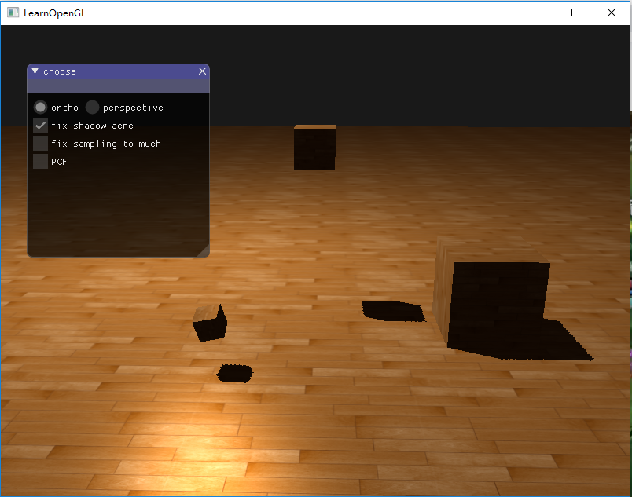
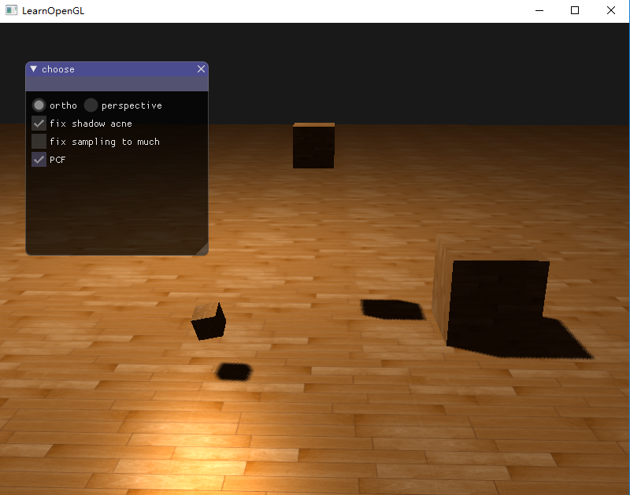
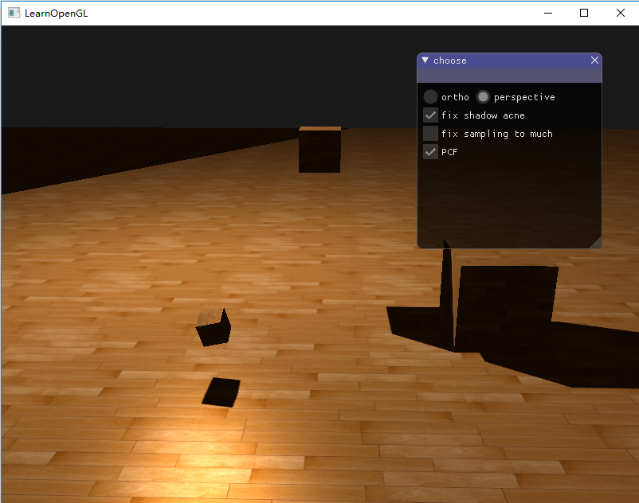

# 作业7实验报告

## 实验要求

Basic:
1. 实现方向光源的Shadowing Mapping:
  要求场景中至少有一个object和一块平面(用于显示shadow)
  光源的投影方式任选其一即可
  在报告里结合代码，解释Shadowing Mapping算法
2. 修改GUI

Bonus:

1. 实现光源在正交/透视两种投影下的Shadowing Mapping
2. 优化Shadowing Mapping (可结合References链接，或其他方法。优化方式越多越好，在报告里说明，有加分)

## 实验截图

1. 正交投影

   

2. 透视投影

   

3. 优化阴影失真问题

   

   

4. PCF优化阴影锯齿

   

   

5. 透视投影时优化采样过多

   

   

## 关键代码

### Shadowing Mapping

要实现阴影映射，我们可以从光源的透视图来渲染场景，并把深度值的结果储存到纹理中，通过这种方式，我们就能对光源的透视图所见的最近的深度值进行采样，这样，深度值就会显示从光源的透视图下见到的第一个片元。在渲染时，渲染一个点的片元，需要决定它是否在阴影中，通过索引深度贴图，来获得从光的视角中最近的可见深度，通过比较该点的深度和最近的可见深度大小，当该点深度比最近可见深度大，则可断定该点被挡住，反之则没挡住。

1. 深度贴图

   第一步我们需要生成一张深度贴图，深度贴图是从光的透视图里渲染的深度纹理，用它计算阴影。在这里我们要做的有为渲染的深度贴图创建帧缓冲对象、创建2D纹理提供给帧缓冲的深度缓冲使用。

   ```c++
   // 为渲染的深度贴图创建帧缓冲对象
   GLuint depthMapFBO;
   glGenFramebuffers(1, &depthMapFBO);
   
   // 创建2D纹理
   GLuint depthMap;
   glGenTextures(1, &depthMap);
   glBindTexture(GL_TEXTURE_2D, depthMap);
   glTexImage2D(GL_TEXTURE_2D, 0, GL_DEPTH_COMPONENT,
                SHADOW_WIDTH, SHADOW_HEIGHT, 0, GL_DEPTH_COMPONENT, GL_FLOAT, NULL);
   glTexParameteri(GL_TEXTURE_2D, GL_TEXTURE_MIN_FILTER, GL_NEAREST);
   glTexParameteri(GL_TEXTURE_2D, GL_TEXTURE_MAG_FILTER, GL_NEAREST);
   glTexParameteri(GL_TEXTURE_2D, GL_TEXTURE_WRAP_S, GL_CLAMP_TO_BORDER);
   glTexParameteri(GL_TEXTURE_2D, GL_TEXTURE_WRAP_T, GL_CLAMP_TO_BORDER);
   
   float borderColor[] = { 1.0f, 1.0f, 1.0f, 1.0f };
   glTexParameterfv(GL_TEXTURE_2D, GL_TEXTURE_BORDER_COLOR, borderColor);
   
   // 把生成的深度纹理作为帧缓冲的深度缓冲
   glBindFramebuffer(GL_FRAMEBUFFER, depthMapFBO);
   glFramebufferTexture2D(GL_FRAMEBUFFER, GL_DEPTH_ATTACHMENT, GL_TEXTURE_2D, depthMap, 0);
   glDrawBuffer(GL_NONE);
   glReadBuffer(GL_NONE);
   glBindFramebuffer(GL_FRAMEBUFFER, 0);
   ```

2. 设置光源，计算光源空间的变换

   我们设置光源使用正交投影，然后计算出光空间的变换矩阵，它将每个世界空间坐标变换到光源处所见到的那个空间，光空间的变换矩阵只要给shader提供光空间的投影和视图矩阵，我们就能像往常那样渲染场景。

   ```c++
   GLfloat near_plane = 1.0f, far_plane = 7.5f;
   glm::mat4 lightProjection;
   if (ortho) {
       lightProjection = glm::ortho(-10.0f, 10.0f, -10.0f, 10.0f, near_plane, far_plane);
   }
   else {
       lightProjection = glm::perspective(45.0f, 1.0f, near_plane, far_plane);
   }
   glm::mat4 lightView = glm::lookAt(lightPos, glm::vec3(0.0f), glm::vec3(0.0f, 1.0f, 0.0f));
   glm::mat4 lightSpaceMatrix = lightProjection * lightView;
   
   depthShader.use();
   depthShader.setMat4("lightSpaceMatrix", lightSpaceMatrix);
   ```

3. 渲染深度贴图

   具体着色器代码则在代码文件中，将光的透视图进行场景渲染，用每个可见片元的最近深度填充了深度缓冲。

   ```c++
   depthShader.use();
   depthShader.setMat4("lightSpaceMatrix", lightSpaceMatrix);
   
   // 首先渲染深度贴图
   glViewport(0, 0, SHADOW_WIDTH, SHADOW_HEIGHT);
   glBindFramebuffer(GL_FRAMEBUFFER, depthMapFBO);
   glClear(GL_DEPTH_BUFFER_BIT);
   glActiveTexture(GL_TEXTURE0);
   glBindTexture(GL_TEXTURE_2D, texture);
   glCullFace(GL_FRONT);
   RenderScene(depthShader);
   glCullFace(GL_BACK);
   glBindFramebuffer(GL_FRAMEBUFFER, 0);
   ```

4. 渲染阴影

   生成深度贴图以后我们就可以开始生成阴影，代码在像素着色器中执行，用来检验一个片元是否在阴影之中，我们在顶点着色器中进行光空间的变换，在片段着色器中计算阴影，通过Phong光照模型进行场景的渲染。

   ```c++
   // 顶点着色器
   #version 330 core
   layout (location = 0) in vec3 position;
   layout (location = 1) in vec3 normal;
   layout (location = 2) in vec2 texCoords;
   
   out vec2 TexCoords;
   
   out VS_OUT {
       vec3 FragPos;
       vec3 Normal;
       vec2 TexCoords;
       vec4 FragPosLightSpace;
   } vs_out;
   
   uniform mat4 projection;
   uniform mat4 view;
   uniform mat4 model;
   uniform mat4 lightSpaceMatrix;
   
   void main()
   {
       gl_Position = projection * view * model * vec4(position, 1.0f);
       vs_out.FragPos = vec3(model * vec4(position, 1.0));
       vs_out.Normal = transpose(inverse(mat3(model))) * normal;
       vs_out.TexCoords = texCoords;
       vs_out.FragPosLightSpace = lightSpaceMatrix * vec4(vs_out.FragPos, 1.0);
   }
   ```

   ```c++
   //片段着色器
   #version 330 core
   out vec4 FragColor;
   
   in VS_OUT {
       vec3 FragPos;
       vec3 Normal;
       vec2 TexCoords;
       vec4 FragPosLightSpace;
   } fs_in;
   
   uniform sampler2D diffuseTexture;
   uniform sampler2D shadowMap;
   
   uniform vec3 lightPos;
   uniform vec3 viewPos;
   uniform bool fix_shadow_acne;
   uniform bool fix_sampling_to_much;
   uniform bool PCF;
   
   float ShadowCalculation(vec4 fragPosLightSpace, float bias)
   {
   	
   
       // 执行透视除法
       vec3 projCoords = fragPosLightSpace.xyz / fragPosLightSpace.w;
       // 变换到[0,1]的范围
       projCoords = projCoords * 0.5 + 0.5;
       // 取得最近点的深度(使用[0,1]范围下的fragPosLight当坐标)
       float closestDepth = texture(shadowMap, projCoords.xy).r; 
       // 取得当前片元在光源视角下的深度
       float currentDepth = projCoords.z;
   
   	// 优化采样过多
   	float shadow = 0.0;
   	if(projCoords.z > 1.0 && fix_sampling_to_much)
           return shadow;
   
       // 检查当前片元是否在阴影中
   
   	// 不采用PCF优化
   	if (!PCF) {
   		return currentDepth - bias > closestDepth  ? 1.0 : 0.0;
   	}
   
   	vec2 texelSize = 1.0 / textureSize(shadowMap, 0);
   	for(int x = -1; x <= 1; ++x)
   	{
   		for(int y = -1; y <= 1; ++y)
   		{
   			float pcfDepth = texture(shadowMap, projCoords.xy + vec2(x, y) * texelSize).r; 
   			shadow += currentDepth - bias > pcfDepth ? 1.0 : 0.0;        
   		}    
   	}
   	shadow /= 9.0;
       
   	return shadow;
   }
   
   void main()
   {           
       vec3 color = texture(diffuseTexture, fs_in.TexCoords).rgb;
       vec3 normal = normalize(fs_in.Normal);
       vec3 lightColor = vec3(1.0);
       // Ambient
       vec3 ambient = 0.15 * color;
       // Diffuse
       vec3 lightDir = normalize(lightPos - fs_in.FragPos);
       float diff = max(dot(lightDir, normal), 0.0);
       vec3 diffuse = diff * lightColor;
       // Specular
       vec3 viewDir = normalize(viewPos - fs_in.FragPos);
       vec3 reflectDir = reflect(-lightDir, normal);
       float spec = 0.0;
       vec3 halfwayDir = normalize(lightDir + viewDir);  
       spec = pow(max(dot(normal, halfwayDir), 0.0), 64.0);
       vec3 specular = spec * lightColor;    
       // 计算阴影
   	
   	// 使用偏移量去除线条阴影
   	float bias = 0;
   	if (fix_shadow_acne) {
   		bias = max(0.05 * (1.0 - dot(normal, lightDir)), 0.005);
   	}
       float shadow = ShadowCalculation(fs_in.FragPosLightSpace, bias);       
       vec3 lighting = (ambient + (1.0 - shadow) * (diffuse + specular)) * color;    
   
       FragColor = vec4(lighting, 1.0f);
   }
   ```

### 阴影优化

1. 使用阴影偏移解决阴影失真

   ```c++
   // 使用偏移量去除线条阴影
   float bias = 0;
   if (fix_shadow_acne) {
       bias = max(0.05 * (1.0 - dot(normal, lightDir)), 0.005);
   }
   float shadow = ShadowCalculation(fs_in.FragPosLightSpace, bias);  
   
   ....
   
   shadow += currentDepth - bias > pcfDepth ? 1.0 : 0.0; 
   ```

2. 使用正面剔除修复peter游移

   ```c++
   glCullFace(GL_FRONT);
   RenderScene(depthShader);
   glCullFace(GL_BACK);
   ...
   glCullFace(GL_FRONT);
   RenderScene(shadowShader);
   glCullFace(GL_BACK);
   ```

3. 通过设置Z坐标大于1的点的shadow值为0解决采样过多

   ```c++
   // 优化采样过多
   float shadow = 0.0;
   if(projCoords.z > 1.0 && fix_sampling_to_much)
       return shadow;
   ```

4. 使用PCF优化阴影锯齿

   ```c++
   // 不采用PCF优化
   if (!PCF) {
       return currentDepth - bias > closestDepth  ? 1.0 : 0.0;
   }
   // 采用PCF优化
   vec2 texelSize = 1.0 / textureSize(shadowMap, 0);
   for(int x = -1; x <= 1; ++x)
   {
       for(int y = -1; y <= 1; ++y)
       {
           float pcfDepth = texture(shadowMap, projCoords.xy + vec2(x, y) * texelSize).r; 
           shadow += currentDepth - bias > pcfDepth ? 1.0 : 0.0;        
       }    
   }
   shadow /= 9.0;
   return shadow;
   ```

   